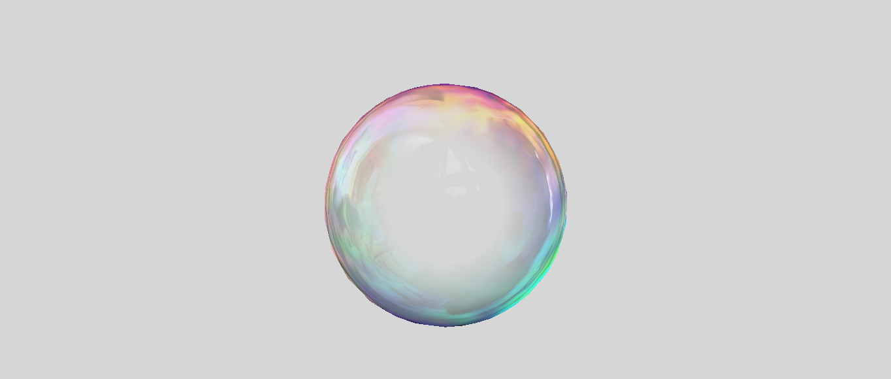

# Bubble Shader

A Unity implementation of the Bubble Shader paper found in the book 

`ShaderX : Vertex and Pixel Shader Tips and Tricks.`

You can find the original paper inside the repo.

I should have all the other papers in another repository. They're great, you should take a look.
EDIT: none are up yet 

Cubemaps and rainbow map were extracted from the PDF. 
Using legacy cubemaps for the time being. Feel free to make a texture out of it.

# Usage

This repo includes a surface shader that mimics the effect of a Soap Bubble. 

To use it, apply it to a sphere or whatever mesh you want. 

You can play around with the Fresnel settings in order to achieve the best look for your bubbles. eheh

# Issues

Currently, there's a weird problem with Fresnel Term calculation, most likely because of the arrangement of the normals of the sphere. 

Will have to try with a different mesh when i have the time. 

But hey, it works fine if you only view it from a certain angle!

# Consider buying me a coffee if you like my work (click the image)

